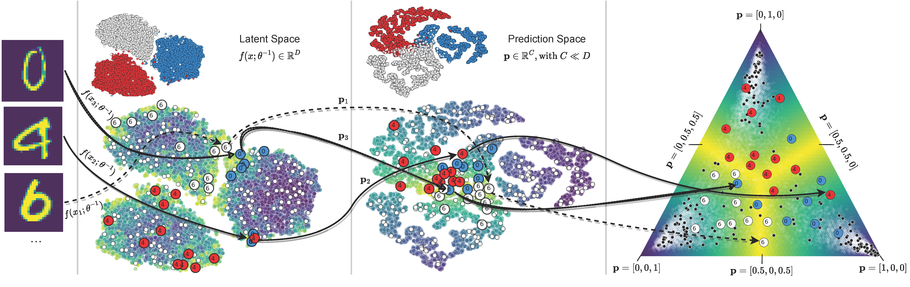

# Supplements to our Paper "FALCUN: A Simple and Efficient Deep Active Learning Strategy"

This repository is partially built on [Kuan-Hao Huang's DeepAL repository](https://github.com/ej0cl6/deep-active-learning) and [Jordan Ash's BADGE repository](https://github.com/JordanAsh/badge) 


We propose a novel deep active learning method called "FALCUN".  



# Getting Started
## Install Requirements
```
python3 -m venv venv
source venv/bin/activate
pip install -U pip
pip install -r requirements.txt
```

## Start MLFlow for Tracking
```
(venv) mlflow server --tracking_uri=${TRACKING_URI}
```
We assume that an mlflow instance is running at ```TRACKING_URI```.

## Run Experiments
Use one of the following scripts to reproduce results on grayscale, rgb, or tabular datasets or the ablation study.

```
(venv) PYTHONPATH=. python executables/falcun_grayscale.py --tracking_uri=${TRACKING_URI}
(venv) PYTHONPATH=. python executables/falcun_rgb.py --tracking_uri=${TRACKING_URI}
(venv) PYTHONPATH=. python executables/falcun_tabular.py --tracking_uri=${TRACKING_URI}
(venv) PYTHONPATH=. python executables/falcun_ablation.py --tracking_uri=${TRACKING_URI}
```

